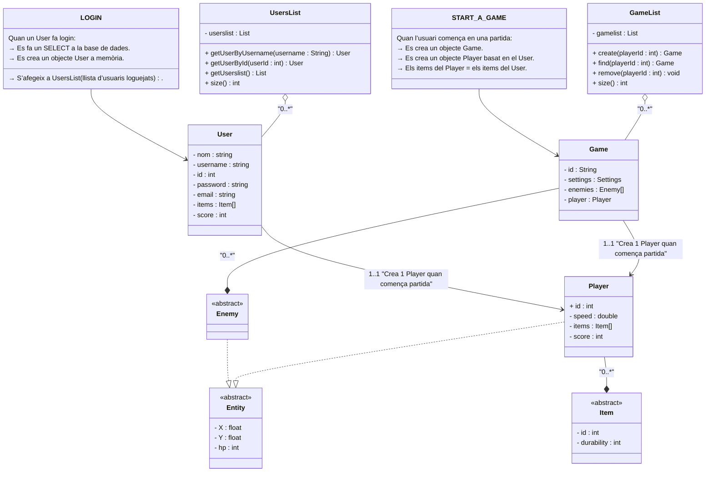

```mermaid
classDiagram

%% ============================================================
%%                    FUNCIONAMENT DEL SISTEMA
%% ============================================================
%% Quan es registra un User:
%%    → Es fa un INSERT a la base de dades.
%%
%% Quan un User fa login:
%%    → Es fa un SELECT a la base de dades.
%%    → Es crea un objecte User a memòria.
%%    → S’afegeix a UsersList (llista d’usuaris loguejats).
%%
%% Quan un User compra items a la tenda:
%%    → Els nous items s’assignen al seu objecte User.
%%    → També es fa UPDATE a la base de dades.
%%
%% Quan l’usuari crea/entra en una partida:
%%    → Es crea un objecte Game.
%%    → Es crea un objecte Player basat en el User.
%%    → Els items del Player = els items del User.
%%
%% Quan acaba una partida:
%%    → Els punts de Player s’afegeixen al score del User.
%%    → UPDATE a la base de dades.
%% ============================================================


%% ========================
%%       ENTITY
%% ========================
class Entity{
    <<abstract>>
    - X : float
    - Y : float
    - hp : int
}


%% ========================
%%         PLAYER
%% ========================
class Player{
    + id : int
    - speed : double
    - items : Item[]
    - score : int
}

Player ..|> Entity


%% ========================
%%         ENEMY
%% ========================
class Enemy{
    <<abstract>>
    %% Enemics dins la partida
}

Enemy ..|> Entity


%% ========================
%%          GAME
%% ========================
class Game{
    - id : String
    - settings : Settings
    - enemies : Enemy[]
    - player : Player
}

Game --> Player : 1..1 "Crea 1 Player quan comença partida"
Game --* Enemy : "0..*"


%% ========================
%%          ITEM
%% ========================
class Item{
    <<abstract>>
    - id : int
    - durability : int
}

Player --* Item : "0..*"


%% ========================
%%           USER
%% ========================
class User{
    - nom : string
    - username : string
    - id : int
    - password : string
    - email : string
    - items : Item[]
    - score : int
}

User --> Player : 1..1 "Crea 1 Player quan comença partida"


%% ============================================================
%%                    USERSLIST
%% ============================================================
class UsersList{
    - userslist : List<User>
    + getUserByUsername(username : String) User
    + getUserById(userId : int) User
    + getUserslist() List<User>
    + size() int
}

UsersList o-- User : "0..*"


%% ============================================================
%%                    GAMELIST
%% ============================================================
class GameList{
    - gamelist : List<Game>
    + create(playerId : int) Game
    + find(playerId : int) Game
    + remove(playerId : int) void
    + size() int
}

GameList o-- Game : "0..*"

%% ============================================================
%%                    START_A_GAME
%% ============================================================
class START_A_GAME{
	Quan l’usuari comença en una partida:
	  → Es crea un objecte Game.
      → Es crea un objecte Player basat en el User.
      → Els items del Player = els items del User.
}
START_A_GAME --> Game

%% ============================================================
%%                    LOGIN
%% ============================================================
class LOGIN {
Quan un User fa login:
    → Es fa un SELECT a la base de dades.
    → Es crea un objecte User a memòria.
    → S’afegeix a UsersList (llista d’usuaris loguejats).
}
LOGIN --> User
```
